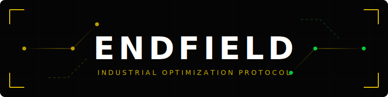
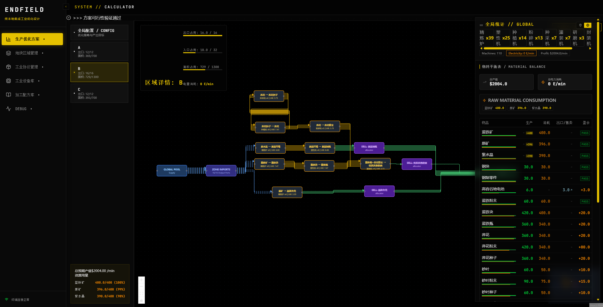

<div align="center">
  
</div>

<div align="center">

# Endfield Industrial Calculator
### Industrial Optimization Protocol

[**中文 (README.md)**](README.md)

</div>

---

### 📖 Introduction
A specialized visual planning and optimization tool for the Endfield industrial system. Design complex factory layouts with drag-and-drop nodes and optimize resource allocation using our advanced algorithmic engine.

### ✨ Key Features
- **Visual Blueprint Designer:** Drag-and-drop nodes to create and manage your factory layout intuitively.
- **Intelligent Optimization:** Automatically calculate the most profitable production ratios based on global resource constraints.
- **Cross-Platform:** Fully compatible with Windows, macOS, and Linux.

### 🖼️ Interface Showcase
<div align="center">
  
</div>

---

### 🚀 Quick Start

#### 1. Prerequisites
Ensure you have the following installed:
- **Node.js:** v18+ [Download](https://nodejs.org/)
- **Python:** v3.13+ [Download](https://www.python.org/)

#### 2. Installation
Run the install script to download dependencies and set up the Python virtual environment.

*   **Windows:**
    ```cmd
    install.bat
    ```
*   **Linux / macOS:**
    ```bash
    chmod +x *.sh
    ./install.sh
    ```

#### 3. Build Frontend
Compile the React application into static assets:

*   **Windows:** `setup.bat`
*   **Linux / macOS:** `./setup.sh`

#### 4. Run Application
The application requires both the Backend and Frontend to be running.

**Step A: Start Backend Solver**
```bash
# Windows
venv\Scripts\activate
python main.py

# Linux / macOS
source venv/bin/activate
python main.py
```
*(Backend runs on port 8000)*

**Step B: Start Frontend**
In a new terminal:
```bash
npm run dev
```
*(Access at: http://localhost:5173)*

---

### ⚙️ Usage
1.  Open your browser to `http://localhost:5173`.
2.  Click the **Settings (⚙️)** icon.
3.  **Select Solver**:
    *   `Built-in (WASM)`: Lightweight, for basic calculations (No backend required).
    *   `Python (FastAPI)`: Recommended for complex multi-zone optimization (Requires backend).

### 🛠️ Tech Stack
- **Frontend:** React, Vite (SWC/Babel), TypeScript
- **Backend:** Python, FastAPI, PuLP (Optimization)
- **UI Theme:** Industrial Sci-Fi (Dark Mode)
